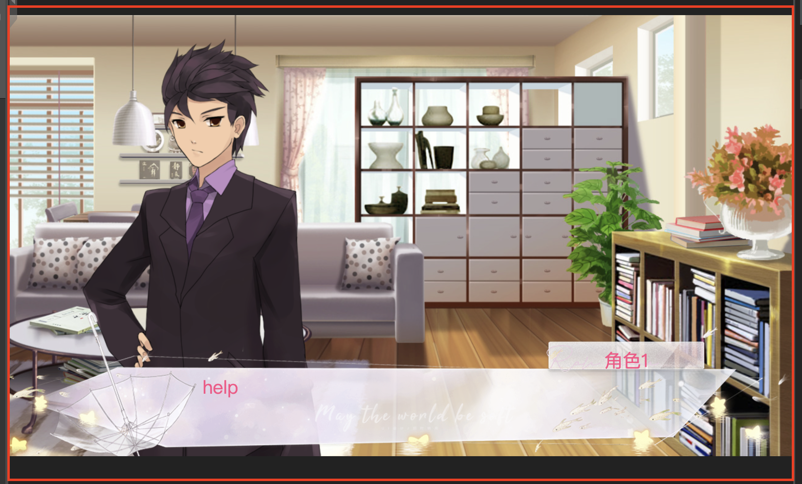

# data struct
```
game: {
    editor: {
        editor-preview(cur frame)
        source
        stages {
            frames
        }[]
    },
    preview: {

    },
    workbench: {
        
    }
}
```

## frame data



minimum data:

| data name | data type |
| ------ | ------ |
| backgroundImage | src string or null |
| people image left | src string or null |
| people image right | src string or null |
| | |  